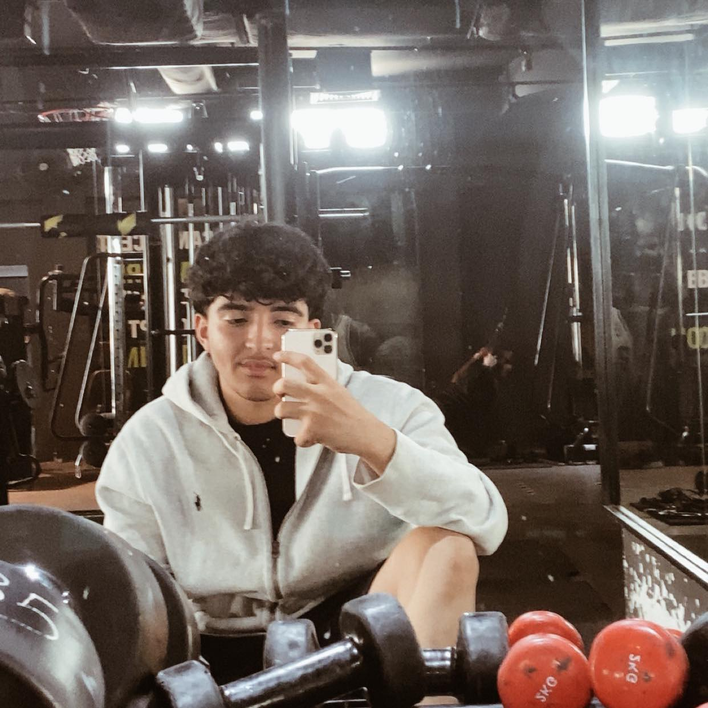

<h1 align="center"><b>Hey, I'm Louay Rjili </b></h1>

  

<!-- Profile Picture -->

## **About Me**

I'm **Louay Rjili**, a Computer Engineering student at ISSATM in Tunisia 💻.  
I'm 25 years old and a Daily Life Photographer on [Vsco](https://vsco.co/yallou007).  
I am passionate about AI, Data Science, and Social Life.  

---

## <b>Let's Connect..!</b>

 
 

---

## <b> Skills</b>

 
 
 
  
 
 

---

## 📊 **GitHub Stats**

  

  

  

  
  

---

### ✍️ **Random Dev Quote**

---

### 🏆 **Trophies**

---

### 🌐 **Languages**
| Language | Proficiency                                                                                     |
|----------|-------------------------------------------------------------------------------------------------|
| EN-US    | Fluent                                                                                         |
| FR-FRA   | Native                                                                                         |
| AR-SA    | Advanced                                                                                       |

---

Credit: [Louay Rjili](https://github.com/Louay007)  
Last Edited: 03/09/2024
